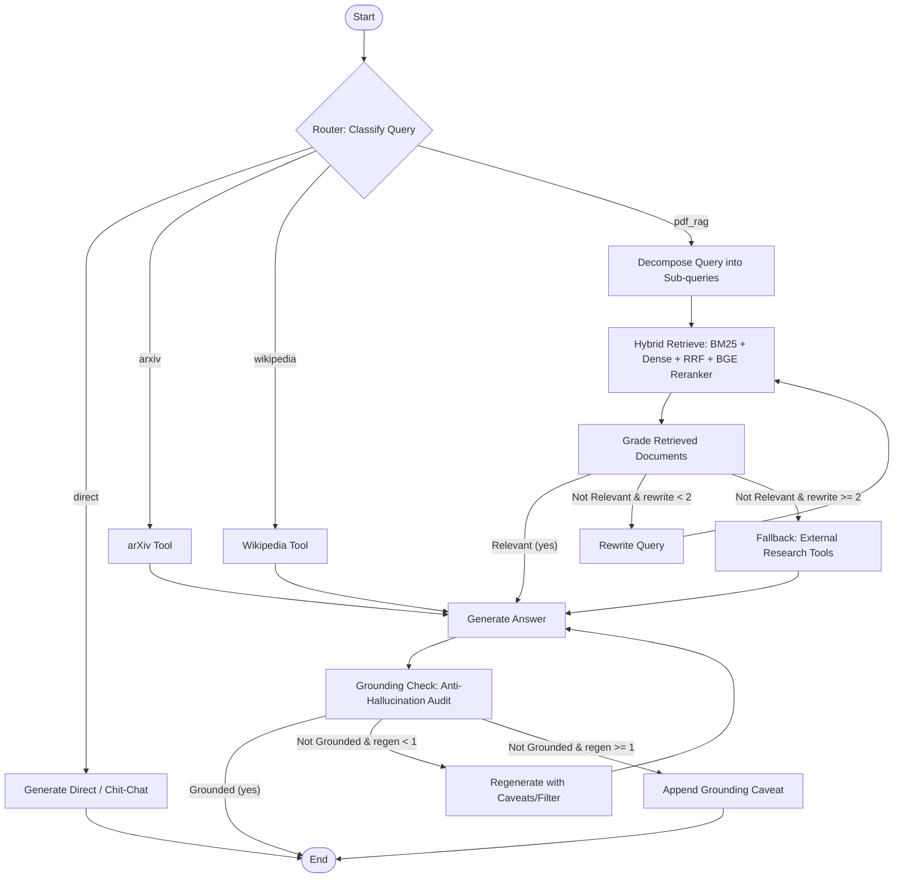

# 🧠 ResearchMind AI

<p align="center">
  
  
  
  
  
  
</p>

ResearchMind AI is an end-to-end, enterprise-grade AI research assistant designed to interact with scientific literature and documents using advanced **Retrieval-Augmented Generation (RAG)**. Users can upload research PDFs, automatically index their semantic contents into a vector database, and perform structured, multi-turn, source-cited conversations powered by Large Language Models.

---

### 🌐 Live Demo
* **Frontend Web App (Vercel):** [https://research-mind-ai-git-main-mohit-25-techs-projects.vercel.app](https://research-mind-ai-git-main-mohit-25-techs-projects.vercel.app)


---

## ✨ Core Features

* 🔐 **Secure Google OAuth & JWT Sessions** — Full user isolation, storing private conversation histories, documents, and vector namespaces safely.
* 📄 **Automated PDF Processing** — Intelligent ingestion pipelines that handle parsing, clean text chunking, and metadata generation.
* ⚡ **High-Speed Cloud Embeddings** — Integrated with Google Gemini Embeddings (`text-embedding-004`) for high-fidelity semantic parsing without local RAM constraints.
* 📦 **Vector Database & Hybrid Search** — Uses ChromaDB for low-latency similarity queries across thousands of research passages.
* 📚 **Multi-Document Scoping & Comparative Analysis** — Select and toggle multiple uploaded papers simultaneously using checkbox controls to scope retrieval (`document_ids`). Compare findings, methodologies, and datasets across multiple research documents with dedicated query decomposition.
* 💬 **Smart Document Scope Pills** — Clear visual pill bar above the chat input indicating currently scoped files with individual removal buttons and a "Clear scope" link. Scoped documents automatically persist per conversation thread.
* 📈 **Contextual Source Citations** — Every generated answer includes exact references to retrieved document fragments, page numbers, or external Wikipedia / arXiv URLs.
* ✏️ **Premium Conversation Workspace** — Smooth title generation, inline renaming, and clean, relative date-grouped threads.
* ⚙️ **Administrative Footers** — Global controls to quickly clear conversation histories or purge documents, resetting the vector collections cleanly.
### System Architecture
```
┌─────────────────┐        Google Token        ┌──────────────────┐
│  React Frontend  ├──────────────────────────>│  FastAPI Backend │
└────────┬────────┘                            └────────┬─────────┘
         │                                              │
         │ Fetch Details / Chat Query                   │ Invoke Agent / Chain
         ▼                                              ▼
┌─────────────────────────────────────────────────────────────────┐
│                    Hybrid & Agentic Pipeline                    │
│                                                                 │
│   ┌───────────────┐     ┌──────────────┐     ┌──────────────┐   │
│   │   ChromaDB    │<────┤ Ollama Embed │     │   Groq LLM   │   │
│   │ (Vector Store)│     │(all-minilm)  │     │  (Qwen/Llama)│   │
│   └───────┬───────┘     └──────────────┘     └──────┬───────┘   │
│           │                                         │           │
│           └─> BM25 + Dense ─> RRF ─> BGE Reranker ──┘           │
└─────────────────────────────────────────────────────────────────┘
                                                              │
                                                              ▼
                                                        [Final Answer]
```

### 🤖 LangGraph Agentic Workflow Diagram


### PDF Ingestion & Query Lifecycle
```
[User Uploads PDF] ──> [PDF Parsing] ──> [Text Chunking] ──> [Ollama Embeddings] ──> [ChromaDB Index]
                                                                                            │
[Streaming Answer + Citations] <── [Agent Verification] <── [Hybrid Fusion & Rerank] <──────┘
``` │
│           └────────────────> Retriever ─────────────┘           │
└─────────────────────────────────────────────────────────────────┘
                                                              │
                                                              ▼
                                                        [Final Answer]
```

### PDF Ingestion & Query Lifecycle
```
[User Uploads PDF] ──> [PDF Parsing] ──> [Text Chunking] ──> [Vector Embedding] ──> [ChromaDB Save]
                                                                                            │
[LLM Response] <── [Prompt Assembly] <── [Semantic Context Retrieval] <── [User Question] ──┘
```

---

## 📂 Project Structure

```
├── app/                      # FastAPI Backend Application
│   ├── api/                  # REST Endpoint Routers (Chat, Documents, Uploads)
│   ├── auth/                 # Google OAuth Verification & JWT Helpers
│   ├── chains/               # RAG Pipeline Chains & Orchestration
│   ├── config/               # Settings, DB Path, & Env Bindings
│   ├── models/               # Pydantic Schemas & LLM Configurations
│   └── services/             # Database Connection & File Systems
├── frontend/                 # Vite + React Frontend Client
│   ├── src/
│   │   ├── api/              # Axios Client & Server Interfaces
│   │   ├── components/       # Reusable Layout Elements (Sidebar, ChatBox)
│   │   ├── context/          # Global Context Providers (Auth)
│   │   ├── hooks/            # Custom Hook Wrappers (useChat, useDocuments)
│   │   ├── pages/            # Core Views (Landing, Dashboard)
│   │   └── types/            # TypeScript Interface Declarations
└── requirements.txt          # Python Third-Party Dependencies
```

---

## 🔌 API Documentation

| Method | Endpoint | Description | Auth Required |
|:---|:---|:---|:---|
| `POST` | `/auth/google` | Verifies Google credentials, auto-registers users, and issues JWT tokens. | No |
| `GET` | `/conversations` | Lists all active conversation threads for the logged-in user. | Yes |
| `PATCH` | `/conversations/{id}` | Renames a specific conversation title. | Yes |
| `PATCH` | `/conversations/{id}/documents` | Updates the active scoped document IDs for a conversation thread. | Yes |
| `DELETE` | `/conversations` | Purges all conversation history logs for the active user. | Yes |
| `POST` | `/upload` | Receives and chunks PDF documents, generating vector indexes. | Yes |
| `GET` | `/documents` | Lists all uploaded research documents for the user. | Yes |
| `DELETE` | `/documents` | Completely purges the user's document database and ChromaDB vectors. | Yes |
| `POST` | `/chat` | Processes queries (supports multi-document `document_ids`), returning context-aware answers. | Yes |
| `POST` | `/stream-chat` | Streams LLM response chunks in real-time with document scoping. | Yes |

---

## ⚙️ Environment Variables Setup

### Backend Environment Variables (`.env`)
| Variable | Description | Default |
|:---|:---|:---|
| `GROQ_API_KEY` | Groq Console API Key (for LLM inferencing). | Required |
| `GOOGLE_API_KEY` | Developer Google Cloud API Key. | Optional |
| `GOOGLE_CLIENT_ID` | Google Console client ID. | Required |
| `JWT_SECRET` | Secret hash signature for signing session tokens. | Required |
| `DATABASE_PATH` | Storage location path for SQLite (`data/researchmind.db`). | `data/researchmind.db` |
| `CHROMA_DB_PATH` | Directory for vector index files (`data/chroma_db`). | `data/chroma_db` |
| `OLLAMA_BASE_URL` | Ollama service endpoint for embeddings. | `http://localhost:11434` |
| `OLLAMA_MODEL` | Ollama model identifier for embeddings. | `all-minilm:l6` |
| `GROQ_MODEL` | Groq LLM model identifier. | `qwen/qwen3.8-27b` |
| `USE_AGENT` | Feature flag: enable LangGraph multi-agent workflow. | `true` |
| `USE_HYBRID` | Feature flag: enable hybrid dense + BM25 sparse search with RRF. | `true` |
| `USE_RERANKER` | Feature flag: enable cross-encoder reranking. | `true` |
| `RERANKER_MODEL` | Sentence-Transformers cross-encoder model name. | `BAAI/bge-reranker-base` |

### Frontend Environment Variables (`frontend/.env`)
| Variable | Description |
|:---|:---|
| `VITE_API_URL` | Base endpoint URL pointing to the FastAPI server. |
| `VITE_GOOGLE_CLIENT_ID` | Client credential matching the Google Login application. |

---

## 🚀 Installation & Local Development

### 1. Backend Service Configuration
Ensure Python 3.10+ is installed on your local host:
```bash
# Clone the repository
git clone https://github.com/Mohit-25-tech/ResearchMind-AI.git
cd ResearchMind-AI

# Create virtual environment
python -m venv .venv
source .venv/bin/activate  # On Windows, use: .venv\Scripts\activate

# Install dependencies
pip install -r requirements.txt

# Start local backend reloading server
uvicorn app.main:app --reload
```
*The backend API server will listen at `http://localhost:8000`.*

### 2. Frontend Development Server
Ensure Node.js v18+ is installed on your system:
```bash
cd frontend

# Install package dependencies
npm install

# Start Vite live reload development server
npm run dev
```
*Open your browser and navigate to `http://localhost:5173`.*

---

## 🧪 Testing & Evaluation

### Running Unit Tests
Unit tests verify Reciprocal Rank Fusion (RRF), BM25 multi-user data isolation, query router structured output parsing, agent cycle limits, Wikipedia external tool fallback, and multi-document scoping:
```bash
pytest -v tests/test_researchmind.py
```

### Running RAGAS Evaluation
Benchmark the 4 retrieval and reasoning configurations:
1. **Baseline MMR**: Dense similarity retrieval with maximal marginal relevance.
2. **Hybrid Search**: BM25 keyword search + Chroma dense embeddings fused via RRF ($k=60$).
3. **Hybrid + Cross-Encoder Rerank**: Re-scoring candidates with `BAAI/bge-reranker-base`.
4. **Full LangGraph Agent**: Routing, query decomposition, document grading, fallback tools, and anti-hallucination grounding checks.

Execute evaluation across the benchmark testset (`eval/testset.json`):
```bash
# Run full benchmark
python -m eval.run_eval

# Run fast smoke test on first 4 questions
python -m eval.run_eval 4
```

Results are saved to:
* `eval/results.csv` — Raw metric scores and latencies.
* `eval/results.md` — Formatted Markdown summary comparison table.

---

## 🗺️ Future Roadmap

- [x] **Multi-Document Comparative Search** — Ask questions across multiple papers simultaneously.
- [ ] **Dark Mode Support** — Seamless light/dark mode transitions.
- [ ] **Export Chat Logs** — Export conversation transcripts as Markdown or PDF.
- [ ] **ArXiv Integration** — Search and import papers directly using ArXiv IDs.
- [ ] **Shared Workspaces** — Collaborative workspaces for research teams.

---

## 🛡️ Security Implementations
1. **Google OAuth 2.0 Identity Token Verification** — Prevents credential spoofing.
2. **Stateful JWT Auth Guards** — Keeps endpoints secured from unauthenticated request payloads.
3. **Database Row-Level Separation** — Queries explicitly filter records by active `user_id`, maintaining strong security boundaries.
4. **Multi-User Vector & Sparse Isolation** — Vector queries and BM25 tokenizers strictly filter by `{"$and": [{"user_id": user_id}, ...]}` ensuring zero cross-tenant leakage.

---

## 📄 License
This project is licensed under the terms of the [MIT License](LICENSE).

---

## 👤 Author
**Mohit Nirmal**
* **GitHub:** [@Mohit-25-tech](https://github.com/Mohit-25-tech)
* **LinkedIn:** [Mohit Nirmal](https://www.linkedin.com/in/mohit-nirmal-2a6951335/)
