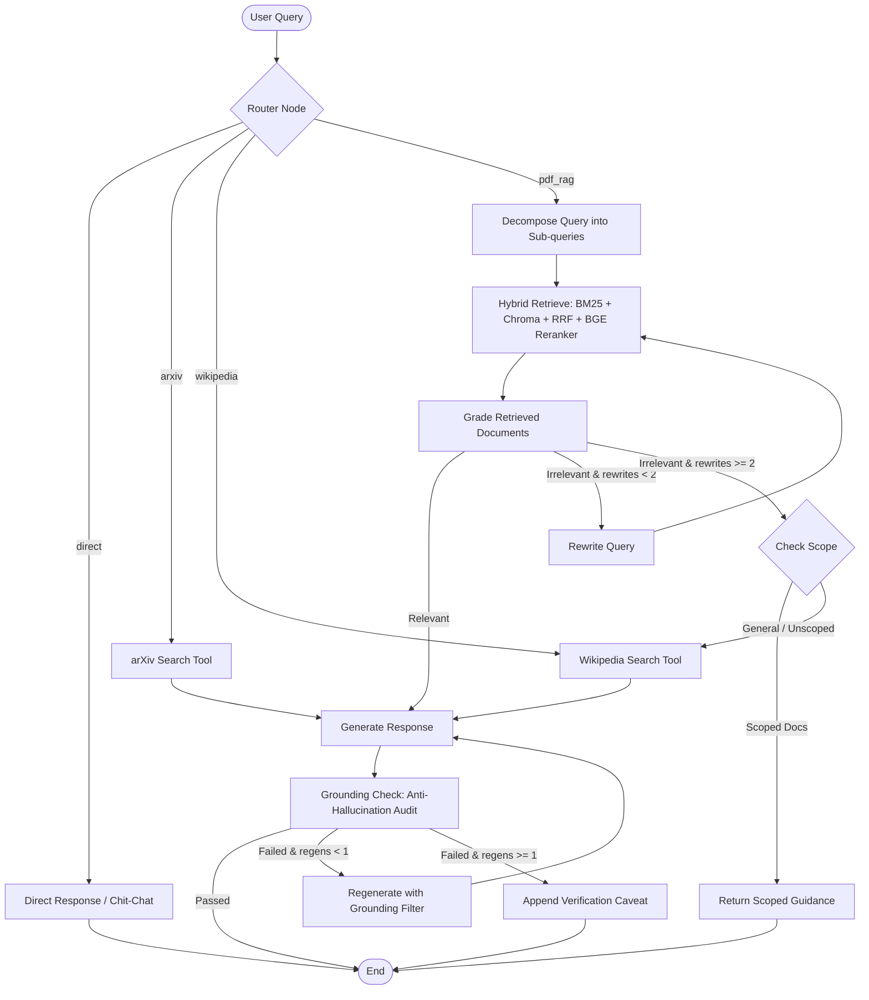

# 🧠 ResearchMind AI

An agentic Retrieval-Augmented Generation (RAG) research assistant for academic literature and technical documents, featuring autonomous LangGraph query routing and decomposition, hybrid BM25 + dense retrieval with cross-encoder reranking, and self-correcting anti-hallucination loops.

<p align="center">
  
  
  
  
  
  
</p>

---

## Demo

[Add screenshot/GIF here]

[Add demo video link here]

---

## ⚡ Key Features

### 1. Agentic Workflow
* **Autonomous Query Routing** (`app/agent/nodes.py`): Zero-shot classifies inbound user queries into `direct` (chit-chat/greetings), `pdf_rag` (scoped document queries), `arxiv` (external preprint lookup), or `wikipedia` (broad factual lookup) via structured LLM decisions.
* **Query Decomposition** (`app/agent/nodes.py`): Analyzes complex or multi-document comparison prompts (e.g., resolving *"how does doc A differ from doc B?"* into exact filenames) and decomposes them into focused sub-queries for parallel vector retrieval.
* **Document Grading & Reflection Loop** (`app/agent/nodes.py`): Grades retrieved passages for binary relevance before synthesis. If evidence is missing or noisy, the agent rewrites the search query (up to 2 attempts) to explore alternative semantic formulations.
* **Fallback Guardrails** (`app/agent/nodes.py`): Intelligently transitions to external research tools (Wikipedia/arXiv) when internal retrieval is exhausted, while suppressing external searches if queries are strictly scoped to uploaded documents.
* **Grounding & Anti-Hallucination Audit** (`app/agent/nodes.py`): Performs a post-generation grounding check comparing generated claims directly against retrieved chunks. If ungrounded assertions are detected, the agent triggers a regeneration pass or appends an explicit verification caveat.

### 2. Hybrid Retrieval
* **Sparse Lexical Search** (`app/rag/hybrid_retriever.py`): Tokenized rank-BM25 indexing optimized for exact matches on technical terminology, acronyms, dataset identifiers, and author names.
* **Dense Semantic Search** (`app/rag/vector_store.py`): Persistent ChromaDB collections querying embeddings generated by local Ollama (`all-minilm:l6`).
* **Reciprocal Rank Fusion (RRF)** (`app/rag/hybrid_retriever.py`): Merges ranked sparse and dense candidate lists using constant $k=60$ rank scoring, eliminating score calibration mismatches between sparse and dense spaces.
* **Cross-Encoder Reranking** (`app/rag/reranker.py`): Leverages `BAAI/bge-reranker-base` via `SentenceTransformerRerank` to perform cross-attentive relevance rescoring, ensuring high-signal passages are concentrated at the top of the context window.

### 3. RAG Architecture
* **Strict Tenant Isolation** (`app/rag/vector_store.py`): Every vector search enforces metadata filters (`{"$and": [{"user_id": user_id}, {"document_id": {"$in": scoped_ids}}]}`), preventing cross-user data leakage.
* **Deterministic Context Assembly** (`app/rag/context.py`): Assembles structured context blocks annotated with source filenames and chunk indexes to ensure precise attribution.
* **Citation Generation** (`app/rag/sources.py`): Extracts and formats exact document references and external URLs directly into API response payloads.

### 4. LLM Inference & Streaming
* **High-Speed Inference** (`app/models/llm.py`): Powered by Groq's LPUs running `qwen/qwen3.8-27b` with retry guards and timeout handling (`ChatGroq`).
* **Real-Time Token Streaming** (`app/api/stream_chat.py`): Server-Sent Events (SSE) streaming endpoint delivering low-latency token delivery with inline source citations.
* **Standard JSON Completion** (`app/api/chat.py`): Synchronous endpoint returning generated answers, full source attribution, and agent execution trace metadata.

### 5. PDF Pipeline
* **Document Ingestion** (`app/rag/loader.py`): Extracts clean text and metadata from uploaded research papers using `PyPDFLoader`.
* **Recursive Character Splitting** (`app/rag/splitter.py`): Chunks text into 1,000-character segments with a 200-character sliding overlap to preserve contextual boundaries across section breaks.
* **Lifecycle Management** (`app/services/document_manager.py`, `app/api/upload.py`): Atomic document upload, SQLite metadata registration, vector indexing, and cascading deletion across disk, SQLite, and ChromaDB.

### 6. Conversational History
* **Thread Persistence** (`app/services/conversation_manager.py`): Multi-turn dialogue management backed by SQLite (`database/research.db`) with conversation-level document scope persistence.
* **Automated Title Generation** (`app/services/title_generator.py`): LLM summarization generates concise, topic-specific conversation titles after the initial interaction.
* **Context Anti-Bleed Guardrails** (`app/prompts/prompts.py`, `app/rag/history.py`): Enforces prompt instructions treating conversation history strictly as pronoun resolution context, preventing prior turns from bleeding into new queries.

### 7. Security & User Isolation
* **Google OAuth 2.0 Verification** (`app/auth/google.py`): Cryptographic verification of Google identity tokens with local development decoding fallback.
* **Stateful JWT Sessions** (`app/auth/jwt.py`): Signed HS256 access tokens with dual-secret rotation support for zero-downtime key rotation.
* **Dependency-Injected Auth Guards** (`app/auth/dependencies.py`): FastAPI `Depends(get_current_user)` enforcing authenticated access across all document and chat routes.
* **Row-Level Database Security** (`app/services/database.py`): Parameterized SQL queries strictly bounded by the authenticated `user_id`.

### 8. Frontend
* **Modern Stack** (`frontend/src/pages/Dashboard.tsx`): React 19, TypeScript, and Vite styled with modern CSS and Tailwind v4.
* **Interactive Scope Selector** (`frontend/src/components/Chat/ChatInput.tsx`): Scope pill bar displaying currently active documents with instant toggle, removal, and clearing controls.
* **Full-Featured Chat Area** (`frontend/src/components/Chat/ChatBox.tsx`, `frontend/src/components/Chat/Message.tsx`): Markdown rendering, code syntax highlighting, copy-to-clipboard utilities, and expandable source citation panels.
* **Responsive Sidebar** (`frontend/src/components/Layout/Sidebar.tsx`): Inline thread renaming, deletion, relative date grouping, and document management modals.

---

## 🏗️ Architecture

### LangGraph Agent Flow



### System Architecture

```
┌─────────────────────────────────────────────────────────────┐
│                 React 19 + TypeScript SPA                   │
│   (Vite, Tailwind v4, Markdown Citations, Scope Selector)   │
└──────────────────────────────┬──────────────────────────────┘
                               │ HTTPS / SSE / Google JWT
                               ▼
┌─────────────────────────────────────────────────────────────┐
│                       FastAPI Backend                       │
│    (Auth Guards, Document Management, SSE Stream Routes)    │
└──────────────────────────────┬──────────────────────────────┘
                               │
                               ▼
┌─────────────────────────────────────────────────────────────┐
│                   LangGraph Agent Pipeline                  │
│                                                             │
│   ┌────────────────────┐  Embeddings  ┌─────────────────┐   │
│   │ ChromaDB (Dense)   │<─────────────┤ Ollama Service  │   │
│   │ metadata-filtered  │              │ (all-minilm:l6) │   │
│   └─────────┬──────────┘              └─────────────────┘   │
│             │                                               │
│             ├──> BM25 + Dense ─> RRF ─> BGE Cross-Encoder   │
│             │                                  │            │
│   ┌─────────┴──────────┐                       ▼            │
│   │ rank-bm25 (Sparse) │              ┌─────────────────┐   │
│   │ in-memory tokenized│              │ Groq LPU (LLM)  │   │
│   └────────────────────┘              │(qwen/qwen3.8)   │   │
│                                       └────────┬────────┘   │
│                                                │            │
│   ┌────────────────────┐                       │            │
│   │ SQLite Storage     │                       │            │
│   │(database/research) │<──────────────────────┘            │
└─────────────────────────────────────────────────────────────┘
                               │
                               ▼
                    [Cited Streaming Output]
```

---

## 🛠️ Tech Stack

| Layer | Technology | Purpose & Details |
|:---|:---|:---|
| **Backend Framework** | [FastAPI](https://fastapi.tiangolo.com/) | High-performance asynchronous REST API, SSE streaming, dependency injection |
| **Agentic Orchestration** | [LangGraph](https://www.langchain.com/langgraph) / [LangChain](https://www.langchain.com/) | Stateful multi-node execution graphs, conditional routing, cyclic reflection loops |
| **Primary LLM** | [Groq](https://groq.com/) (`qwen/qwen3.8-27b`) | Low-latency inference for routing, grading, rewriting, and answer generation |
| **Dense Embeddings** | [Ollama](https://ollama.com/) (`all-minilm:l6`) | Local embedding generation running on `http://localhost:11434` (384-dim) |
| **Vector Database** | [ChromaDB](https://www.trychroma.com/) | Persistent local vector storage with tenant and document metadata filtering |
| **Sparse Retrieval** | [rank-bm25](https://pypi.org/project/rank-bm25/) | Lexical keyword retrieval for technical terms, datasets, and named entities |
| **Reranking** | [Sentence-Transformers](https://sbert.net/) (`BAAI/bge-reranker-base`) | Cross-encoder contextual relevance rescoring of fused candidate passages |
| **Relational Database** | [SQLite](https://sqlite.org/) | ACID-compliant storage for users, conversations, messages, and document records |
| **Authentication** | Google OAuth 2.0 & [PyJWT](https://pyjwt.readthedocs.io/) | Google token exchange, cryptographically signed HS256 session access tokens |
| **Evaluation** | [RAGAS](https://docs.ragas.io/) & [Hugging Face Datasets](https://huggingface.co/docs/datasets/) | Automated evaluation of faithfulness, answer relevance, precision, and recall |
| **Frontend Framework** | [React 19](https://react.dev/) & [TypeScript](https://www.typescriptlang.org/) | Type-safe declarative UI architecture built with [Vite 8](https://vite.dev/) |
| **Styling & UI** | [Tailwind CSS v4](https://tailwindcss.com/) & [Lucide Icons](https://lucide.dev/) | Glassmorphic design tokens, responsive layout, and interactive modal dialogs |

---

## 🚀 Getting Started

### Prerequisites
* **Python**: `3.10.8+`
* **Node.js**: `v18+` and `npm`
* **Ollama**: Installed and running locally
* **Groq API Key**: Obtainable from the [Groq Console](https://console.groq.com/)
* **Google OAuth Client ID**: Configured via Google Cloud Console

---

### 1. Clone & Set Up Ollama

```bash
# Clone the repository
git clone https://github.com/Mohit-25-tech/ResearchMind-AI.git
cd aI_research

# Start Ollama service (if not already running as a daemon)
ollama serve

# Pull the required embedding model
ollama pull all-minilm:l6
```

---

### 2. Configure Environment Variables

Create `.env` in the project root:

```env
# LLM Configuration
GROQ_API_KEY=gsk_your_groq_api_key_here
GROQ_MODEL=qwen/qwen3.8-27b

# Embeddings & Ollama
OLLAMA_BASE_URL=http://localhost:11434
OLLAMA_EMBED_MODEL=all-minilm:l6

# Security & Auth
JWT_SECRET=your_jwt_secret_key_change_in_production
JWT_ALGORITHM=HS256
JWT_EXPIRATION_MINUTES=1440
GOOGLE_CLIENT_ID=your_google_client_id.apps.googleusercontent.com

# Storage Paths
DATABASE_PATH=database/research.db
CHROMA_DB_PATH=chroma_db
UPLOAD_DIR=uploads

# Pipeline Feature Flags
USE_AGENT=true
USE_HYBRID=true
USE_RERANKER=true
RERANKER_MODEL=BAAI/bge-reranker-base
```

Create `frontend/.env`:

```env
VITE_API_URL=http://localhost:8000
VITE_GOOGLE_CLIENT_ID=your_google_client_id.apps.googleusercontent.com
```

---

### 3. Backend Setup

```bash
# Create and activate virtual environment
python -m venv .venv

# On Linux/macOS:
source .venv/bin/activate
# On Windows (PowerShell):
.venv\Scripts\Activate.ps1

# Install dependencies
pip install -r requirements.txt

# Start the FastAPI application server
uvicorn app.main:app --reload --host 127.0.0.1 --port 8000
```
Backend API docs will be available at: `http://localhost:8000/docs`.

---

### 4. Frontend Setup

```bash
# Navigate to the frontend directory
cd frontend

# Install dependencies
npm install

# Start Vite development server
npm run dev
```
Open your browser at `http://localhost:5173`.

---

## 📊 Evaluation

ResearchMind includes an automated evaluation pipeline (`eval/run_eval.py`) that benchmarks retrieval and generation performance using the **RAGAS** framework across 4 configurations:

1. **`baseline_mmr`**: Dense vector similarity retrieval using Maximal Marginal Relevance.
2. **`hybrid`**: BM25 sparse keyword search + Chroma dense embeddings fused via Reciprocal Rank Fusion ($k=60$).
3. **`hybrid_rerank`**: Hybrid search followed by `BAAI/bge-reranker-base` cross-encoder rescoring.
4. **`full_agent`**: Complete LangGraph agent with routing, query decomposition, grading, rewrite loops, and grounding checks.

### Running the Evaluation Pipeline

```bash
# Run a quick smoke test on the first 4 questions
python -m eval.run_eval --subset 4

# Run the complete 25-question academic benchmark
python -m eval.run_eval
```

Outputs are automatically generated in `eval/`:
* `eval/raw_results.jsonl` — Cached step-by-step query executions and latencies.
* `eval/results.csv` — Granular per-question metric scores.
* `eval/results.md` — Aggregated Markdown summary report.
* `eval/results_chart.png` — Visual comparison bar chart.

### Benchmark Results

[Add results table here after running eval/run_eval.py]

---

## 📁 Project Structure

```
aI_research/
├── app/
│   ├── agent/                 # LangGraph Agentic Pipeline
│   │   ├── graph.py           # StateGraph builder, conditional edge routing, runner
│   │   ├── nodes.py           # Graph nodes: router, decompose, retrieve, grade, generate, grounding
│   │   ├── state.py           # TypedDict AgentState definition
│   │   └── tools.py           # External fallback tools (Wikipedia, arXiv)
│   ├── api/                   # FastAPI Endpoint Routers
│   │   ├── chat.py            # Synchronous chat endpoint with trace metadata
│   │   ├── conversations.py   # Thread CRUD & document scope persistence
│   │   ├── documents.py       # Document listing & deletion
│   │   ├── stream_chat.py     # Server-Sent Events (SSE) token streaming
│   │   └── upload.py          # PDF upload, ingestion, & vector indexing
│   ├── auth/                  # Authentication & Authorization
│   │   ├── dependencies.py    # FastAPI Depends(get_current_user) auth guards
│   │   ├── google.py          # Google OAuth ID token verification
│   │   └── jwt.py             # JWT token creation, decoding, & secret rotation
│   ├── chains/                # Deterministic RAG Chain Fallback
│   │   └── rag_chain.py       # Linear LangChain pipeline for non-agent runs
│   ├── config/                # Environment Settings
│   │   └── settings.py        # Pydantic BaseSettings & feature flags
│   ├── models/                # LLM & Schema Definitions
│   │   └── llm.py             # ChatGroq model instance configuration
│   ├── prompts/               # Prompt Templates
│   │   └── prompts.py         # Router, decompose, grading, generate, & grounding prompts
│   ├── rag/                   # Retrieval Components
│   │   ├── context.py         # Context string formatting with source labels
│   │   ├── embeddings.py      # OllamaEmbeddings factory
│   │   ├── history.py         # Chat history formatting for prompt injection
│   │   ├── hybrid_retriever.py# BM25 + Dense Chroma + RRF fusion implementation
│   │   ├── loader.py          # PyPDFLoader wrapper
│   │   ├── reranker.py        # BAAI/bge-reranker-base cross-encoder reranker
│   │   ├── sources.py         # Source metadata extraction and citation builder
│   │   ├── splitter.py        # RecursiveCharacterTextSplitter configuration
│   │   └── vector_store.py    # ChromaDB client initialisation & collection handlers
│   ├── services/              # Core Services & Storage
│   │   ├── conversation_manager.py # Thread conversation and scope management
│   │   ├── database.py        # SQLite schema creation, connection pooling, & queries
│   │   ├── document_manager.py# File storage and ChromaDB lifecycle operations
│   │   └── title_generator.py # Automatic conversation title generator
│   └── main.py                # FastAPI app initialization, CORS, and router registration
├── eval/                      # RAGAS Evaluation Framework
│   ├── run_eval.py            # Automated benchmark evaluation harness
│   ├── testset.json           # 25 curated academic & technical benchmark questions
│   ├── results.csv            # Evaluation metric outputs
│   ├── results.md             # Markdown comparison report
│   └── results_chart.png      # Matplotlib benchmark visualization
├── frontend/                  # React 19 Frontend Client
│   ├── src/
│   │   ├── api/client.ts      # Axios HTTP client with JWT interceptors
│   │   ├── components/
│   │   │   ├── Chat/          # ChatBox, ChatInput, Message, SourcePanel
│   │   │   ├── Documents/     # DocumentCard, DocumentList, UploadButton
│   │   │   ├── Layout/        # Header, Sidebar (threads, scoping, purge controls)
│   │   │   └── Common/        # EmptyState, ErrorMessage, Loading spinners
│   │   ├── config/config.ts   # Client-side configuration constants
│   │   ├── context/AuthContext.tsx # Google OAuth state & session management
│   │   ├── hooks/             # Custom hooks (useChat, useDocuments)
│   │   ├── pages/             # Dashboard.tsx (main workspace), Landing.tsx
│   │   ├── types/index.ts     # TypeScript interfaces (Message, Document, Thread)
│   │   └── utils/copyToClipboard.ts # Clipboard helper utility
│   ├── package.json           # Frontend dependencies (React 19, Tailwind v4, Vite 8)
│   └── vite.config.ts         # Vite build and proxy configuration
├── database/                  # SQLite storage directory (`research.db`)
├── chroma_db/                 # ChromaDB vector store persistent storage
├── requirements.txt           # Python backend dependencies
└── runtime.txt                # Python runtime specification (python-3.10.8)
```

---

## 🔮 Roadmap / Future Work

* [ ] **Langfuse Tracing Integration** *(Planned)* — Full distributed tracing and observability across LangGraph node transitions, latency per node, and token spending.
* [ ] **Containerized Deployment** *(Planned)* — Multi-stage `Dockerfile` and `docker-compose.yml` orchestrating FastAPI, frontend static builds, Ollama, and ChromaDB.
* [ ] **Semantic Caching** *(Planned)* — Redis-backed semantic cache to instantly serve semantically equivalent research queries without re-invoking LLM inference.
* [ ] **Model Context Protocol (MCP) Server** *(Planned)* — Expose ResearchMind's hybrid retrieval and document scoping tools as a standard MCP server for external agent workflows.
* [ ] **Prompt-Injection Guardrails on Uploads** *(Planned)* — Pre-ingestion sanitizer scanning PDF text chunks for prompt injections, system prompt override attempts, and adversarial formatting before vector indexing.

---

## 📄 License

[Add License here - e.g., MIT License]

---

## 👤 Author

**Mohit Nirmal**
* **GitHub**: [@Mohit-25-tech](https://github.com/Mohit-25-tech)
* **LinkedIn**: [Mohit Nirmal](https://www.linkedin.com/in/mohit-nirmal-2a6951335/)
